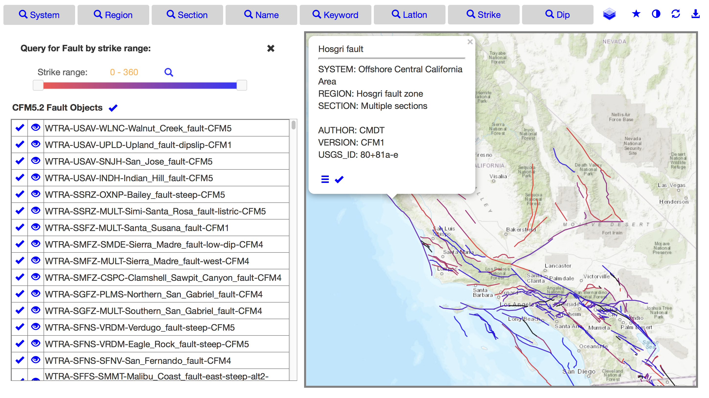

# CFM

Community Fault Model

## Live demo , 

http://asperity.scec.org/CFM/web/cfm_view.html

## Software requirements

Software stack at the backend server node when postgres and postgis are
being built from source:

      git

      gcc
      readline-develp
      zlib-devel
      json-c
      autoconf
      libxml2-devel
      libtool

      postgres version a10.5
        
      proj5
      gdal

      postgis version 2.5.1

      apache web service

      install cfm viewer from git to /var/www/html 

Instructions to stand up the cfm viewer on a micro node reserved from AWS cloud service
are in doc/

    `run-as-me`, for the installer who is installing the software stack

    `run-as-postgres`, for user, postgres, who is bringing up the postgres server

    `run-as-httpd`, for installing and starting up the web service

Data preprocessing instruction are in doc/ and the scripts are in schema/scripts 

## Layout 

### Server Side 
       
    Postgres/Postgis database
    TS/SHP data files
    PHP scripts for accessing database
    Apache web service to manage incoming
       and outgoing instruction/data

### Client Side 

    JS scripts to process and manage data product
    Html web page for graphics display and user dashboard
       

        
